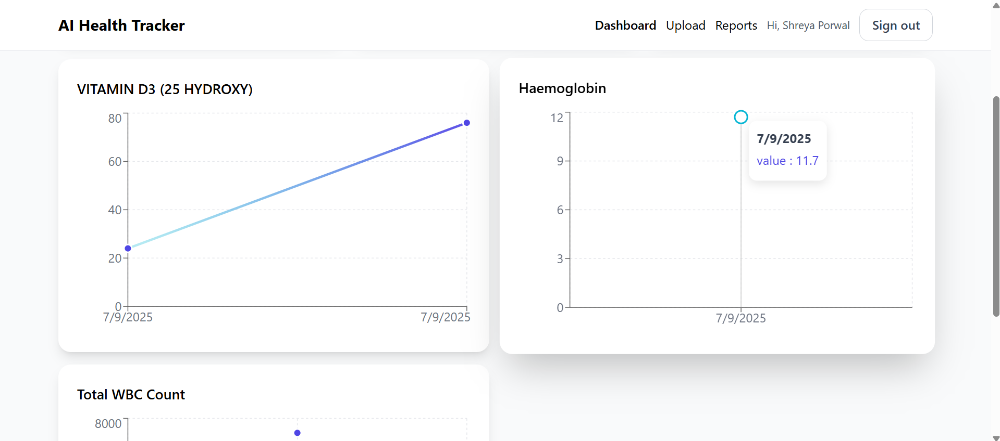
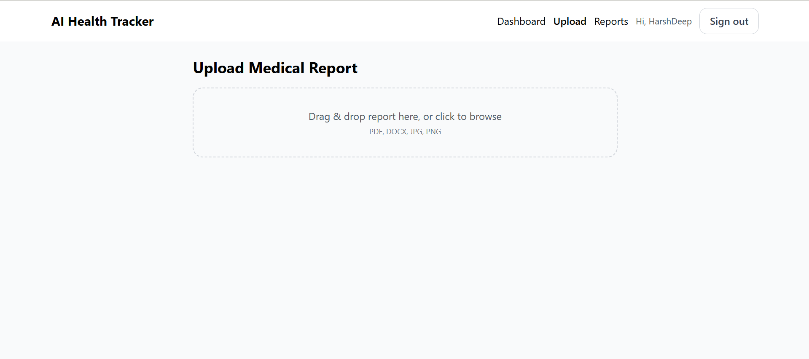
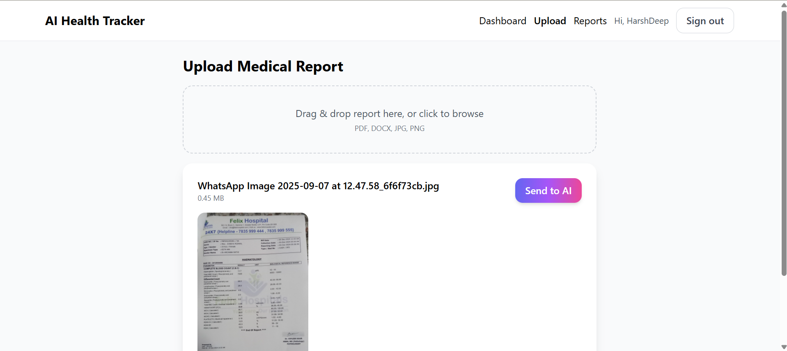
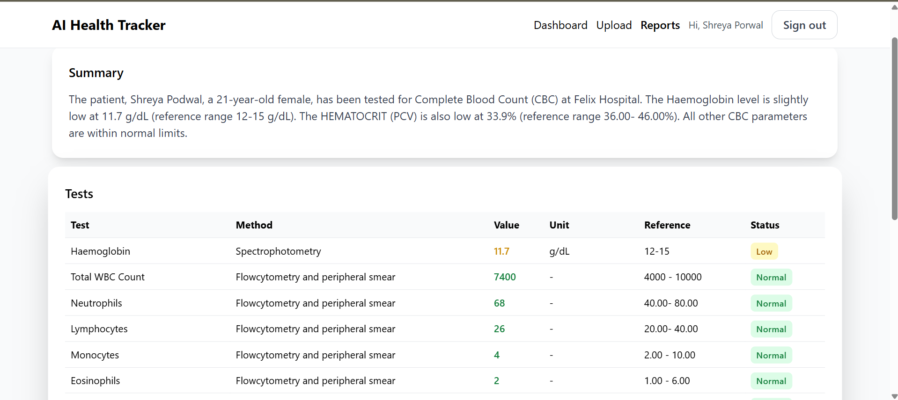

# 🏥 AI-Powered Medical Report Analysis  

This project is a **full-stack web application** that allows patients or doctors to upload medical reports (PDF, Word, or Image).  
The backend extracts text, sends it to Google Gemini AI for parsing, and generates:  

✅ Structured report details  
✅ Patient information  
✅ Extracted test metrics with trends (charts)  
✅ A plain-English summary of the report  

---

## 🚀 Features  

- User authentication (Signup / Login with JWT)  
- Upload medical reports (`.pdf`, `.docx`, `.jpg`, `.png`)  
- AI-powered parsing (Gemini API)  
- Extract patient & test details into structured JSON  
- Store and track metrics over time  
- Dashboard with charts & status counts (Normal / High / Low)  

---

## 🛠️ Tech Stack  

**Frontend:** React, Vite, Tailwind CSS, Recharts  
**Backend:** Node.js, Express, MongoDB, Mongoose, JWT  
**AI:** Google Gemini API  

---

## 📂 Project Structure  

```bash
Medical_Report_Analysis/
│
├── backend/         # Node.js + Express + MongoDB
│   ├── models/      # Mongoose Schemas
│   ├── routes/      # API Routes (Auth, Reports)
│   ├── server.js    # Entry point
│   └── .env         # Environment variables
│
├── frontend/        # React + Vite + Tailwind
│   ├── src/         # React components, pages, api.js
│   └── .env         # Frontend environment (VITE_API_BASE_URL)
│
└── README.md        # Project Documentation
```

---

## ⚙️ Installation & Setup  

### 1️⃣ Clone the Repository  

```bash
git clone https://github.com/shreyaporwal2003/Medical_Report_Analysis.git
cd Medical_Report_Analysis

```
### 2️⃣ Backend Setup
 ```bash
cd backend
npm install
```

**Create a .env file inside backend/ with:**
```bash
MONGO_URI=your_mongo_connection_string
JWT_SECRET=your_secret_key
PORT=5000
GEMINI_API_KEY=your_google_gemini_api_key
```
**Run the backend:**
```bash
node server.js
```
### 3️⃣ Frontend Setup
``` bash
cd ../frontend
npm install
```
**Create a .env file inside frontend/ with:**
```bash
VITE_API_BASE_URL=http://localhost:5000/api
```
**Run the frontend:**
```bash
npm run dev
```
## 📸 Project Glimpses  


## 🔑 Sign In


## 📌 Dashboard


## 📌 Dashboard (Alternative View)


## Upload Report




## 📜 Report History


## 📑 Reports



---

## 🧑‍💻 Author  

**Shreya Porwal**  

- GitHub: [@shreyaporwal2003](https://github.com/shreyaporwal2003)  
- LinkedIn: [shreya_porwal](https://www.linkedin.com/in/shreyaporwal167/)  
- Email: shreyaporwal167@gmail.com 

